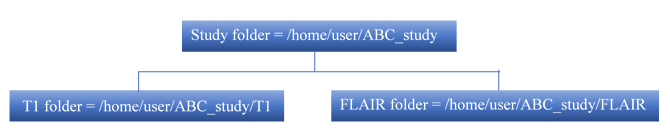

Longitudinal Pipeline
=====================

Longitudinal version of UBO Detector is only available in commandline at the moment.

Data Preparation
----------------

The longitudinal pipeline required a slightly different data preparation. Specifically, T1 and FLAIR data need to be renamed as ID_tp1_*.nii.gz, ID_tp2_*.nii.gz, where tp is an abbreviation of time point, tp1 means the first time point, and tp2 is the second time point, etc. These data should be saved in a similar folder structure as that described for cross-sectional UBO Detector processing:

Running Longitudinal Pipeline
------------------------------

**Step 1:** Add path in MATLAB. `addpath ('/path_to_CNS/WMH_extraction/WMHextraction_long');`

**Step 2:** Run longitudinal pipeline. 
`WMHextraction_long_paired (studyFolder, Ntp, spm12path, dartelTemplate, k, PVWMH_magnitude, coregExcldList, segExcldList, classifier, ageRange, probThr, outputFormat);`

where:

   - `studyFolder` is the path to the study folder
   - `Ntp` is the number of time points
   - `spm12path` is the path to SPM12
   - `dartelTemplate` is either 'existing template' or 'creating template'
   - `k` is the k for kNN
   - `PVWMH_magnitude` is the distance (in mm) from lateral ventricles which defines periventricular and deep WMH
   - `coregExcldList` is the list of IDs who failed FLAIR-to-T1 coregistration, and will be excluded in future analyses. Use '' to pass an empty list
   - `segExcldList` is the list of IDs who failed the T1 segmentation step, and will be excluded in future analyses. Use '' to pass an empty list
   - `classifier` is either 'built-in' or 'customised'
   - `ageRange` is either 'lt55', '65to75', or '70to80'
   - `probThr` is the probability threshold to threshold WMH probability map
   - `outputFormat` is how you want to view the QC results, either 'web', 'arch', or 'web&arch'.
