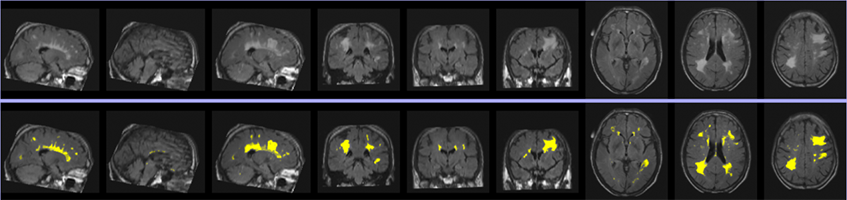

Quick Start Guide
=================

Data Preparation
----------------
Data Preparation

In order to fit in UBO Detector, both T1 and FLAIR sequences are required (\*.nii or \*.nii.gz). The data should be named with a unique ID which can be numeric numbers or letters or combination of the two, followed by an underscore (e.g. 1111_ABCstudy_T1.nii, 1111_flairABC.nii.gz), and stored in two folders (T1 and FLAIR (all upper case)) under the study folder. For example:

.. image:: neuroimaging-quick-start-manual-datapreparation.png

WMH Extraction
--------------
This section describes how to extract WMH with UBO Detector graphic user interface (GUI).

**Step 1:** In MATLAB, `addpath('/path/to/CNS'`) and run `CNS`

**Step 2:** Open the UBO Detector through `WMH -> Extract WMH`.

**Step 3:** Find the Study Directory by clicking `Find`.

**Step 4:** Find `spm12` folder.

**Step 5:** Specify how you would like to view the coregistration, segmentation, and final results for quality control (QC).

*Display on screen* - Results will be displayed in MATLAB web browser by calling the web function in MATLAB.
*Download to check locally* - Results will be exported into a HTML webpage, and compressed for download
*Both* - both *Display on screen* and *Download*

.. image:: neuroimaging-quick-start-manual-wmhextraction.png

**Step 6:** *"Extract with QC stops"* if you want to exclude scans failed coregistration or segmentation QC, or Extract without QC stops if you want to complete the extraction without stops. *“Extract without QC stops”* will not allow you to exclude any subjects from the process, but will generate the same QC figures as *“Extract with QC stops”* (i.e. coregistration, segmentation, final QC), which is stored in the `<studyFolder>/subjects/QC` folder.
 
**Step 7:** If selected *“Extract with QC stops”* in Step 6. The pipeline will generate QC webpage after coregistration. Depending on the means of viewing the results specified in Step 5, the coregistration results will be either displayed as a webpage on screen, or available for download, or both display and download. Please input the IDs failed coregistration QC (separated by space) in the Quality Control section, and click *Finish and continue*.
 
**Step 8:** If selected *“Extract with QC stops”* in Step 6. The pipeline will generate QC webpage after segmentation. The segmentation results will be available according to what you specified in Step 5. Input the IDs failed segmentation QC (separated by space) in the Quality Control section, and click *Finish and continue*.
 
**Step 9:** The final results will be available according to Step 5 after finishing all the extraction steps.

Output
------
UBO Detector will provide both image and text file output. WMH volumes are calculated in SPM’s DARTEL space. Therefore, there is no need to adjust for intracranial volume (ICV). By default, any WMHs <12 mm from lateral ventricles are considered as periventricular WMH regions.

*Image: An example of extracted WMH. The first row is three slices of FLAIR on each plane, and the second row is extracted WMH overlain on FLAIR.*

Folder structure of UBO Detector output
---------------------------------------
(Blue = folders, Orange = files)

.. image:: neuroimaging-quick-start-manual-folder-structure.png

Image Output
------------

Image output of **whole brain** WMH is located at: `/<study_folder>/subjects/<subject_ID>/mri/extractedWMH/<ID>_WMH.nii.gz`

Image output of **regional** WMH is at:

*Periventricular WMH:* `/<study_folder>/subjects/<subject_ID>/mri/extractedWMH/<ID>_ PVWMH.nii.gz`

*Deep WMH:* `/<study_folder>/subjects/<subject_ID>/mri/extractedWMH/<ID>_DWMH.nii.gz`

*Lobar WMH:* `/<study_folder>/subjects/<subject_ID>/mri/extractedWMH/lobarWMH/<ID>_*_WMH.nii.gz`

*Arterial territories WMH:* `/<study_folder>/subjects/<subject_ID>/mri/extractedWMH/arterialWMH/<ID>_*_WMH.nii.gz`

*Abbreviation of arterial territories:* A.A.H., anterior artery hemisphere; A.A.C., anterior artery callosal; A.A.M.L., anterior artery medial lenticulostriate; M.A.H., middle artery hemisphere; M.A.L.L., middle artery lateral lenticulostriate; P.A.H., posterior artery hemisphere; P.A.C., posterior artery callosal; P.A.T.M.P., posterior artery thalamic and midbrain perforators.

Text File Output
----------------

In addition to WMH volumes, UBO Detector also counts total number of WMH incidences (NoI), i.e. number of 26-connection clusters, as well as the number of punctuate (< 10.125 mm3, i.e. 3 voxels on DARTEL space), focal (< 30.375 mm3, i.e. 9 voxels on DARTEL space), medium (< 50.625 mm3, i.e. 15 voxels on DARTEL space), and confluent (> 50.625 mm3) incidences. Both volumes and NoI of the whole brain, as well as periventricular, deep, lobar, and arterial regions, are summarized.

**Individual** WMH estimation can be found at:

`/<study_folder>/subjects/<subject_ID>/stats/<ID>_WMH_vol.txt`

`/<study_folder>/subjects/<subject_ID>/stats/<ID>_WMH_NoI.txt`

WMH summary of the whole study is at: `/<study_folder>/subjects/WMH_spreadsheet.txt`

**For more information, bug reporting and suggestions please contact:** cns.cheba@unsw.edu.au

